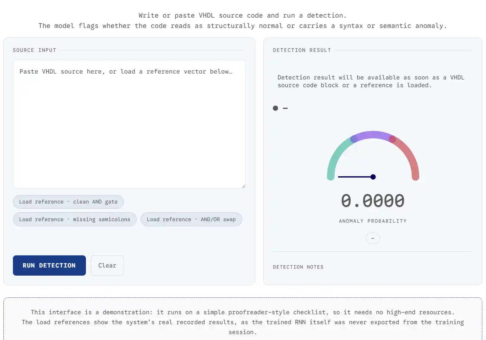

# 🚀 Détecteur d'Anomalies du code VHDL


> Un réseau de neurones récurrent (RNN) implémenté **entièrement en NumPy, sans framework de deep learning**, qui analyse du code source VHDL tokenisé pour détecter des erreurs syntaxiques et sémantiques avant simulation. Le projet évolue vers une cellule LSTM manuelle bidirectionnelle à tête multi-tâches.

## 📸 Démo



## 📊 Résultats (run de référence — RNN vanille)

Ces chiffres sont ceux du run de référence actuel (RNN vanille, avant passage au LSTM — voir la feuille de route ci-dessous). Par principe, l'exactitude n'est jamais présentée seule :

| Métrique                                         | Valeur     |
| ------------------------------------------------- | ---------- |
| Exactitude globale (test)                          | **78,40 %** |
| Détection des erreurs syntaxiques                  | **~80 %**   |
| Sensibilité sur les erreurs sémantiques            | **~60 %**   |
| Taux de faux positifs résiduel (code sain)         | **~21 %**   |

F1, ROC-AUC, matrice de confusion et rappel détaillé par type d'erreur sont en cours de production (tableau d'ablation) et viendront compléter ce tableau.

## ⚙️ Démarrage rapide

```
# 1. Cloner le dépôt
git clone https://github.com/ilyassboudade/vhdl-anomaly-detection.git

# 2. Installer les dépendances (versions épinglées dans requirements.txt)
pip install -r requirements.txt

# 3. Lancer le notebook (pipeline complet : nettoyage → mutation → tokenisation → entraînement)
jupyter notebook
```

> Un script `predict.py` en ligne de commande (`python predict.py --file exemple.vhd`) fait partie de la feuille de route (interface applicative) mais n'est pas encore disponible.

## 🛠️ Pile technique & architecture

- **Langage :** Python 3.10
- **Données :** HuggingFace Datasets (`hdl2v/vhdl-dataset`)
- **Deep Learning :** NumPy pur — aucun framework de deep learning, c'est l'argument différenciant du projet
- **Tokenisation :** tokenizer regex spécifique VHDL (mots-clés, identifiants, opérateurs, nombres, symboles), granularité **token-level** (jamais caractère par caractère), normalisation en majuscules
- **Stockage :** JSON (vocabulaire, types d'erreurs), NumPy NPZ (splits), CSV (audit)
- **Outils :** Git, Jupyter Notebook, Linux/Bash

### Architecture actuelle (référence)

RNN vanille séquentiel :

```
h_t    = tanh(E[x_t] · Wx + h_{t-1} · Wh)
logits = h_T · Wo + bo
```

Hyperparamètres actuels :

| Paramètre    | Valeur                                                   |
| ------------ | --------------------------------------------------------- |
| `EMBED_DIM`  | 64                                                        |
| `HIDDEN_DIM` | 128                                                       |
| `N_BINARY`   | 2 (sain / anomalie)                                       |
| `N_MULTI`    | 4 (types de mutation, tête masquée sur les échantillons sains) |
| `LR`         | 3e-3 *(à ramener vers 1e-3 avec décroissance)*             |
| `BATCH_SIZE` | 64                                                        |
| `EPOCHS`     | 15                                                        |
| `CLIP_NORM`  | 5.0 (norme globale)                                       |

> ⚠️ Le passage à une cellule LSTM manuelle (portes concaténées, BPTT complet, gradient checking) est en cours — voir *Feuille de route* ci-dessous.

## 📦 Jeu de données et stratégies de mutation (`/data`)

Corpus source : `hdl2v/vhdl-dataset` (HuggingFace), nettoyé et dédupliqué → **8 613 échantillons** (4 307 sains / 4 306 corrompus, `random_state=42` pour l'échantillonnage du pool muté).

| Stratégie de mutation                                     | Type d'erreur          | Occurrences | Exemple                                          |
| ----------------------------------------------------------- | ------------------------ | :---------: | ------------------------------------------------- |
| Suppression d'éléments structurels essentiels                | **Structural Havoc**     |    1 079    | Incohérence entité/architecture                    |
| Désorganisation des instructions internes                    | **Scramble Architecture**|     947     | Instructions logiques mélangées dans `architecture`|
| Corruption de syntaxe (`=>` ↔ `<=`, réordonnancement)        | **Syntax Corruption**    |    1 126    | Opérateurs d'affectation inversés                  |
| Injection de code inutile                                    | **Dead Code Injection**  |    1 154    | Signal déclaré et jamais utilisé                   |
| —                                                             | **Sain (None)**          |    4 307    | —                                                   |

Séquences complétées/tronquées à **512 tokens**.

Livrables (`/data`) :

| Fichier              | Type            | Schéma                                                              |
| --------------------- | ---------------- | ---------------------------------------------------------------------- |
| `vocab.json`           | JSON             | `token_string ➔ index` (dont `<PAD>`, `<UNK>`, `<BOS>`, `<EOS>`)        |
| `error_types.json`     | JSON             | `error_string ➔ index` (les 4 catégories ci-dessus)                    |
| `train.npz`            | NumPy Binaire    | `input_ids (N, 512)`, `labels (N,)`, `error_types (N,)`                |
| `val.npz`              | NumPy Binaire    | Structure identique, dédié au réglage des hyperparamètres              |
| `test.npz`             | NumPy Binaire    | **Jeu de test verrouillé** jusqu'à l'évaluation finale                 |
| `vhdl_dataset.csv`      | CSV              | Code brut, mutations et labels correspondants, pour audit              |

## 🔁 Reproduire l'entraînement

Le pipeline (nettoyage → mutation → tokenisation → encodage → entraînement) s'exécute depuis le notebook fourni à la racine du dépôt. Le split train/val/test doit être réalisé **par fichier source, avant mutation**, pour éviter toute fuite de données ; la graine exacte et les proportions du split seront documentées ici dès qu'elles auront été extraites du notebook (voir *Limites connues*).

## ⚠️ Limites connues & feuille de route

**Points à vérifier avant de généraliser les résultats :**

- Risque de fuite de données si le split train/val/test n'est pas effectué par fichier source *avant* mutation.
- Masque de padding absent dans la boucle RNN actuelle : dérouler le réseau sur le padding peut écraser l'état caché utile.
- Rétropropagation du run de référence à confirmer : dans le `train_step` actuel, seules `Wo`/`bo` semblent mises à jour — si `Wx`, `Wh` et l'embedding `E` ne le sont pas, la stagnation autour de 78 % pourrait venir de ce bug autant que de l'évanouissement du gradient.
- Risque de raccourcis d'apprentissage (mots-clés Verilog injectés, suppression de `LIBRARY`) : à mesurer en isolant cette mutation.

**Prochaines étapes :**

- Masque de padding + mean-pooling masqué sur les états cachés.
- Cellule LSTM manuelle (portes concaténées, biais d'oubli initialisé à +1.0, initialisation Xavier/orthogonale, vérification par gradient checking, clipping par norme globale).
- Passage en Bi-LSTM + tête multi-tâches (sain/corrompu + type d'erreur parmi les 4 catégories).
- Adam avec correction de biais explicite, dropout, early stopping sur la F1 de validation.
- Métriques complètes (Accuracy, F1, ROC-AUC, matrice de confusion, rappel par type d'erreur) et tableau d'ablation.
- Interface applicative avec carte de saillance par token, puis site vitrine.

## 👥 Équipe

- Ilyass Boudade
- Zakaria Atik
- Youssef Douiba

**Encadrement :** Pr. Salma Hannouni, Pr. El Habib Benlahmar
**Affiliation :** Licence d'Excellence en Intelligence Artificielle, FS Ben M'Sik — Université Hassan II de Casablanca
**Cadre :** Projet de Fin de Module (PFM) — Deep Learning

## 📄 Licence

À définir.
